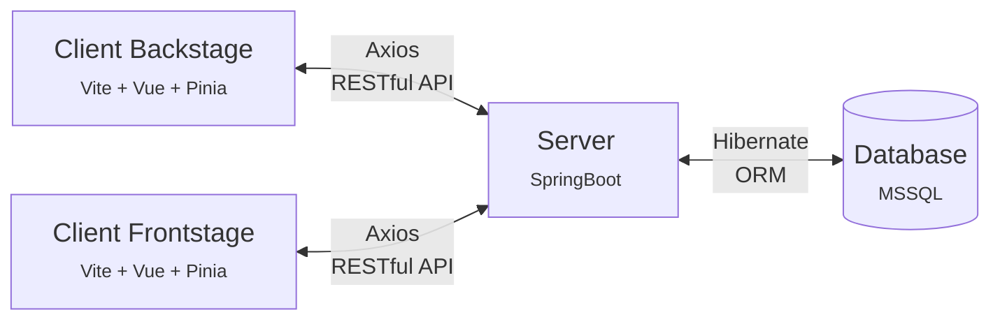

<div align="center">

  <h1 align="center">Fithub</h1>

</div>

<!-- TABLE OF CONTENTS -->

## Table of Contents

- [關於 Fithub](#關於-Fithub)
- [建立後端專案](#建立後端專案)
- [資料庫](#資料庫)
- [功能](#功能)
- [致謝](#致謝)
- [與我聯絡](#與我聯絡)

<!-- ABOUT THE PROJECT -->

## 關於 Fithub

\- 其他語言: [English](README.md)

&emsp;
Fithub 是一間致力於促進健康生活方式的專業健身中心。我們旨在鼓勵並引導個人建立規律的運動習慣，超越舒適區，實現身心健康，以更堅定的姿態迎接各種挑戰。作為您健身之旅的伙伴，Fithub 提供多樣化的訓練課程和場地租借服務，讓您能夠在專業指導下享受運動的樂趣，並將其融入日常生活。無論您是初學者還是有豐富鍛練經驗者，我們都致力於為您提供最適合的訓練方案，讓您在健康之路上取得持久的成就。立足於優質設施和熱情教練的支持下，Fithub 期待能與您攜手，共同塑造健康、活力的生活方式。

### 系統環境及架構

- 資料庫
  - SQL Server 2019 / 2022 (Database)
    <br/><br/>
- 後端
  - SpringBoot v3.1.2 (Framework)
  - Jpa / Hibernate (ORM)
    <br/><br/>
- 前端
  - Vite v.4.4.6 (Project Built Tool)
  - Vue v.3.3.4 (Framework)
  - pinia v.2.1.6 (Store library)
  - pinia-plugin-persistedstate v3.2.0
  - Axios v1.5.0
  - naive-ui v2.34.4
  - Bootstrap v5.2.3
    <br/><br/>

* 這個存儲庫 (repo) 是 Fithub 專案的後端部分，前端部分的存儲庫連結如下:

  - [Fithub-frontend-backstage](https://github.com/ChrislaFolia/Fithub-frontend-backstage)
  - [Fithub-frontend-frontstage](https://github.com/ChrislaFolia/Fithub-frontend-frontstage)

* Fithub 專案的前端-後端-資料庫結構如下：



<!-- GETTING STARTED -->

## 建立後端專案

### 前置作業

- STS (Spring Tool 4)
- Maven project
- Microsoft SQL Server

### 專案建立

1. 使用 STS 建立一個 Maven project
1. 取得專案儲存庫

   ```sh
   git clone https://github.com/ChrislaFolia/Fithub-backend.git
   ```

1. 進行 SpringBoot 設定檔 `application.properties` 之設定

   ```java
   # port
   server.port = 8080

   # ContextPath
   server.servlet.context-path = /fithub

   # DB connection
    spring.datasource.driver-class-name=com.microsoft.sqlserver.jdbc.SQLServerDriver
    spring.datasource.url=jdbc:sqlserver://localhost:1433;databaseName=Fithub;encrypt=true;trustServerCertificate=true
    spring.datasource.username = yourUserName
    spring.datasource.password = yourPassword

   # JPA Config
    spring.jpa.properties.hibernate.dialect=org.hibernate.dialect.SQLServerDialect
    spring.jpa.show-sql=false
    spring.jpa.properties.hibernate.format_sql = false
    spring.jpa.hibernate.naming.physical-strategy = org. hibernate.boot.model.naming.PhysicalNamingStrategyStandardImpl

   # open put and delete request
   spring.mvc.hiddenmethod.filter.enabled = true
   ```

1. 强制更新（Force update）Fithub Maven 專案

### 專案執行

1. 移動至專案目錄

1. 執行開發任務：
   - 啟動伺服器，運行於 http://localhost:8080/fithub
   - 在任何檔案變更時伺服器會自動重新啟動

### HTTP 端點

- 執行 `ngrok.exe`
- 新增身份驗證令牌

  ```sh
  ngrok config add-authtoken <token>
  ```

- 啓動 tunnel

  ```sh
  ngrok http 8080
  ```

- ngrok HTTP 端點資訊請參考: [Link](https://ngrok.com/docs/http/)

## 資料庫

Fithub 專案之資料庫配置，為使用 SQL Server Management Studio（SSMS） 連接至 Microsoft SQL Server 資料庫（MSSQL）。

## 功能

- 會員系統
- 課程商城
- 場地租借
- 優惠券系統

## 致謝

感謝以下負責人為 Fithub 網頁帶來以下功能的實現：

- 會員系統（由 QingJun 完成）
- 課程系統（由 Chris Xiao 完成）
- 場地租借系統（由 William 完成）
- 優惠券系統（由 Archer Lee 完成）

你們的努力和專業使得這些關鍵功能成功實現，為 iSpan 課程的期末專案做出了重要貢獻。感謝你們在 Fithub 網頁開發過程中的精彩工作！

## 與我聯絡

- 蕭祐仁 (Chris Xiao) - [linkedin](https://www.linkedin.com/in/you-ren-hsiao-520997158/)

- Fithub 專案相關連結
  - 後端 : [https://github.com/ChrislaFolia/Fithub-backend](https://github.com/ChrislaFolia/Fithub-backend)
  - 前端 (前臺部分) : [https://github.com/ChrislaFolia/Fithub-frontend-frontstage](https://github.com/ChrislaFolia/Fithub-frontend-frontstage)
  - 前端 (後臺部分) : [https://github.com/ChrislaFolia/Fithub-frontend-backstage](https://github.com/ChrislaFolia/Fithub-frontend-backstage)
